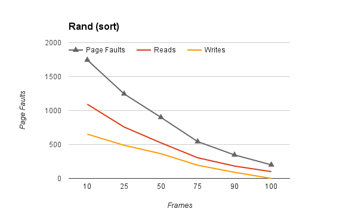
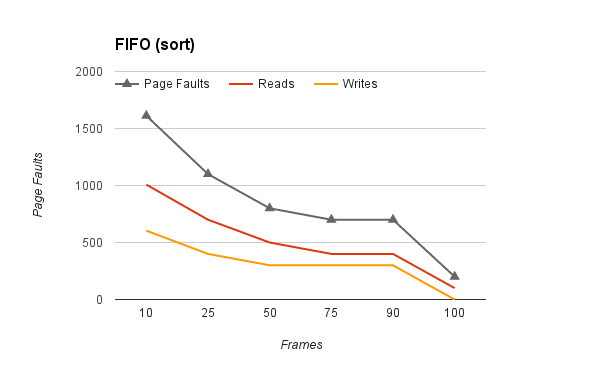
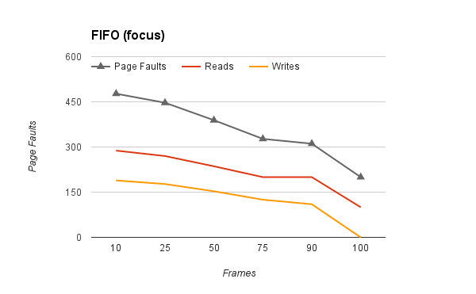

\newpage

# Appendix A - Test Resultater

## Tilfældig udskiftning

### Sort
| Pages | Frames | Faults | Reads | Writes |
|-------|--------|--------|-------|--------|
|   100 |     10 |   1744 |  1092 |    652 |
|   100 |     25 |   1245 |   757 |    488 |
|   100 |     50 |    899 |   524 |    364 |
|   100 |     75 |    542 |   304 |    194 |
|   100 |     90 |    346 |   182 |     90 |
|   100 |    100 |    200 |   100 |      0 |

Diagrammet foroven viser sort programmet med den tilfældige udskiftnings algoritme.

### Scan
| Pages | Frames | Faults | Reads | Writes |
|-------|--------|--------|-------|--------|
|   100 |     10 |   1200 |  1100 |    100 |
|   100 |     25 |   1176 |  1076 |    100 |
|   100 |     50 |    982 |   882 |    100 |
|   100 |     75 |    661 |   561 |    100 |
|   100 |     90 |    401 |   381 |     88 |
|   100 |    100 |    200 |   100 |      0 |

Diagrammet foroven viser scan programmet med den tilfældige udskiftnings algoritme.

### Focus
| Pages | Frames | Faults | Reads | Writes |
|-------|--------|--------|-------|--------|
|   100 |     10 |    478 |   289 |    189 |
|   100 |     25 |    435 |   264 |    169 |
|   100 |     50 |    357 |   216 |    127 |
|   100 |     75 |    287 |   164 |     81 |
|   100 |     90 |    237 |   126 |     36 |
|   100 |    100 |    200 |   100 |      0 |

Diagrammet foroven viser focus programmet med den tilfældige udskiftnings algoritme.

## FIFO udskiftning

### Sort
| Pages | Frames | Faults | Reads | Writes |
|-------|--------|--------|-------|--------|
|   100 |     10 |   1612 |  1008 |    604 |
|   100 |     25 |   1100 |   700 |    400 |
|   100 |     50 |    800 |   500 |    300 |
|   100 |     75 |    700 |   400 |    300 |
|   100 |     90 |    700 |   400 |    300 |
|   100 |    100 |    200 |   100 |      0 |

Diagrammet foroven viser sort programmet med FIFO.

### Scan
| Pages | Frames | Faults | Reads | Writes |
|-------|--------|--------|-------|--------|
|   100 |     10 |   1200 |  1100 |    100 |
|   100 |     25 |   1200 |  1100 |    100 |
|   100 |     50 |   1200 |  1100 |    100 |
|   100 |     75 |   1200 |  1100 |    100 |
|   100 |     90 |   1200 |  1100 |    100 |
|   100 |    100 |    200 |   100 |      0 |

Diagrammet foroven viser scan programmet med FIFO.

### Focus
| Pages | Frames | Faults | Reads | Writes |
|-------|--------|--------|-------|--------|
|   100 |     10 |    477 |   288 |    189 |
|   100 |     25 |    447 |   270 |    177 |
|   100 |     50 |    389 |   236 |    153 |
|   100 |     75 |    327 |   200 |    125 |
|   100 |     90 |    311 |   200 |    110 |
|   100 |    100 |    200 |   100 |      0 |

Diagrammet foroven viser focus programmet med FIFO.

## Custom(Second-Chance) udskiftning

### Sort
| Pages | Frames | Faults | Reads | Writes |
|-------|--------|--------|-------|--------|
|   100 |     10 |   1606 |  1006 |    600 |
|   100 |     25 |   1100 |   700 |    400 |
|   100 |     50 |    800 |   500 |    300 |
|   100 |     75 |    697 |   398 |    298 |
|   100 |     90 |    699 |   399 |    299 |
|   100 |    100 |    200 |   100 |      0 |

Diagrammet foroven viser sort programmet med Second-Chance algoritmen.

### Scan
| Pages | Frames | Faults | Reads | Writes |
|-------|--------|--------|-------|--------|
|   100 |     10 |   1200 |  1100 |    100 |
|   100 |     25 |   1200 |  1100 |    100 |
|   100 |     50 |   1200 |  1100 |    100 |
|   100 |     75 |   1199 |  1009 |    100 |
|   100 |     90 |   1199 |  1009 |    100 |
|   100 |    100 |    200 |   100 |      0 |

Diagrammet foroven viser scan programmet med Second-Chance algoritmen.

### Focus
| Pages | Frames | Faults | Reads | Writes |
|-------|--------|--------|-------|--------|
|   100 |     10 |    477 |   288 |    189 |
|   100 |     25 |    446 |   269 |    177 |
|   100 |     50 |    388 |   235 |    152 |
|   100 |     75 |    326 |   199 |    123 |
|   100 |     90 |    310 |   199 |    108 |
|   100 |    100 |    200 |   100 |      0 |

Diagrammet foroven viser focus programmet med Second-Chance algoritmen.

\newpage

