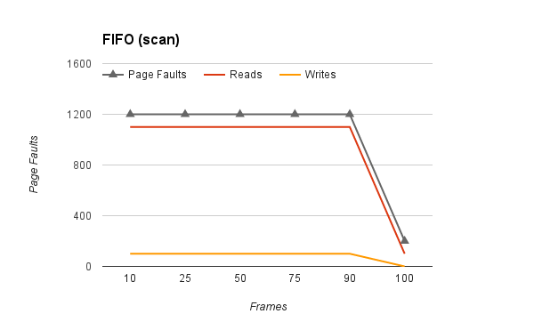
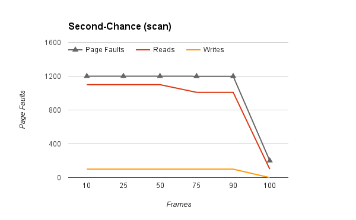

# Testing

For at teste implementationen af udskiftnings algoritmerne er der implementeret en variable `fault_counter`, der angiver antallet af page faults der har været igennem programmets kørsel. Bemærk at når man første gang laver programmet med `make` vil der forekomme to advarsler, som kommer fra page_table.c og program.c, hvilket er filer der ikke er foretaget ændringer.

Programmet køres på følgende måde:

`./virtmem npages nframes <rand|fifo|custom> <sort|scan|focus>`

Generelt er der testet ved brug af udskrifter af variabler ved brug af `page_table_print_entry()` og `print_second_chance`, men for at afgøre og måle de forskellige algoritmer mod hinanden har vi kørt hver algoritme igennem hvert program med 100 sider i alt med varierende rammer og aflæst `fault_counter` der udskrives til sidst i programmet. Med denne information opstilles tabeller og der udarbejdes diagrammer for hver af de forskellige programmer med de forskellige algoritmer.

## Tilfældig udskiftning

### Sort
| Pages | Frames | Faults |
|-------|--------|--------|
|   100 |     10 |   1744 |
|   100 |     25 |   1245 |
|   100 |     50 |    899 |
|   100 |     75 |    542 |
|   100 |     90 |    346 |
|   100 |    100 |    200 |

Diagrammet foroven viser sort programmet med den tilfældige udskiftnings algoritme.

### Scan
| Pages | Frames | Faults |
|-------|--------|--------|
|   100 |     10 |   1200 |
|   100 |     25 |   1176 |
|   100 |     50 |    982 |
|   100 |     75 |    661 |
|   100 |     90 |    401 |
|   100 |    100 |    200 |

Diagrammet foroven viser scan programmet med den tilfældige udskiftnings algoritme.

### Focus
| Pages | Frames | Faults |
|-------|--------|--------|
|   100 |     10 |    478 |
|   100 |     25 |    435 |
|   100 |     50 |    357 |
|   100 |     75 |    287 |
|   100 |     90 |    237 |
|   100 |    100 |    200 |

Diagrammet foroven viser focus programmet med den tilfældige udskiftnings algoritme.

## FIFO udskiftning

### Sort
| Pages | Frames | Faults |
|-------|--------|--------|
|   100 |     10 |   1612 |
|   100 |     25 |   1100 |
|   100 |     50 |    800 |
|   100 |     75 |    700 |
|   100 |     90 |    700 |
|   100 |    100 |    200 |

Diagrammet foroven viser sort programmet med FIFO.

### Scan
| Pages | Frames | Faults |
|-------|--------|--------|
|   100 |     10 |   1200 |
|   100 |     25 |   1200 |
|   100 |     50 |   1200 |
|   100 |     75 |   1200 |
|   100 |     90 |   1200 |
|   100 |    100 |    200 |

Diagrammet foroven viser scan programmet med FIFO.

### Focus
| Pages | Frames | Faults |
|-------|--------|--------|
|   100 |     10 |    477 |
|   100 |     25 |    447 |
|   100 |     50 |    389 |
|   100 |     75 |    327 |
|   100 |     90 |    311 |
|   100 |    100 |    200 |

Diagrammet foroven viser focus programmet med FIFO.

## Custom(Second-Chance) udskiftning

### Sort
| Pages | Frames | Faults |
|-------|--------|--------|
|   100 |     10 |   1611 |
|   100 |     25 |   1100 |
|   100 |     50 |    800 |
|   100 |     75 |    697 |
|   100 |     90 |    699 |
|   100 |    100 |    200 |

Diagrammet foroven viser sort programmet med Second-Chance algoritmen.

### Scan
| Pages | Frames | Faults |
|-------|--------|--------|
|   100 |     10 |   1200 |
|   100 |     25 |   1200 |
|   100 |     50 |   1200 |
|   100 |     75 |   1199 |
|   100 |     90 |   1199 |
|   100 |    100 |    200 |

Diagrammet foroven viser scan programmet med Second-Chance algoritmen.

### Focus
| Pages | Frames | Faults |
|-------|--------|--------|
|   100 |     10 |    477 |
|   100 |     25 |    446 |
|   100 |     50 |    388 |
|   100 |     75 |    326 |
|   100 |     90 |    310 |
|   100 |    100 |    200 |

Diagrammet foroven viser focus programmet med Second-Chance algoritmen.

## Diskussion
Ud fra resultaterne kan man se at den tilfældige algoritme er meget hurtigere end de to andre. Det skal dog bemærkes, at selvom denne er hurtigere med disse programmer, så kunne det blive værre hvis ikke `lrand48()` genereret et uniform tilfældigt tal, da dette kunne forudsage et værste tilfælde hvor det tilfældige tal er det samme i alle tilfælde.

Desuden er det værd at bemærke at Second-Chance kun er bedre end FIFO med 1 page fault i de fleste tilfælde. Nærmere udforskning med mindre tal har dog vist at der kan være større forskel, som f.eks. at køre Second-Chance og FIFO med 4 sider og 3 rammer med sort. Dette passer efter teorien at Second-Chance vil i værste tilfælde have lige så mange page faults som FIFO.

